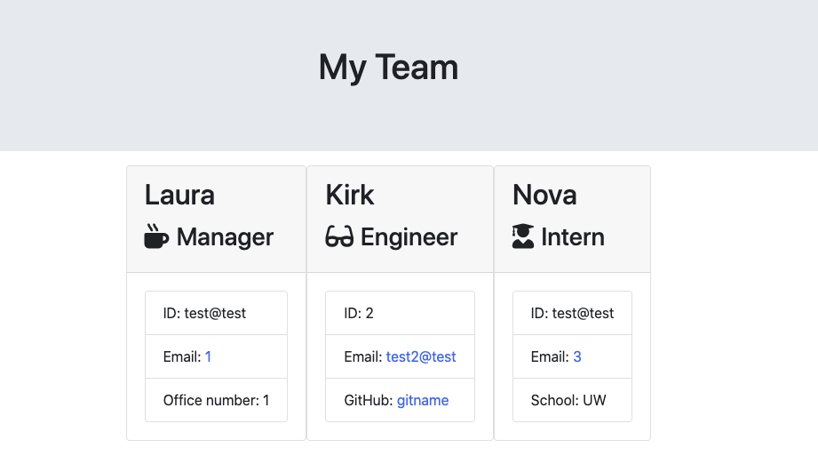

# Employee_Summary_Build

## Description
If you need a way to collect information about a team of employees use this application. It will build cards to organize and hold informatiion about each team member.  

## Table of Contents

* [Title](#Title)

* [Description](##Description)

* [Links-to-project](##Links-to-project)

* [Installation](##Installation)

* [User-Story](##User-Story)

* [License](##License)

* [Contribution](##Contribution)  

* [Test](##Test)

* [Images](##Images)

* [Credits](##Credits)

* [Questions](##Questions)

## Links-to-project 
[Employee_Summary_Build](https://lauragwendolynburch.github.io/Employee_Summary_Build/)

[Github Repo](https://github.com/LauraGwendolynBurch/Employee_Summary_Build)

## Installation
* node.js
* express 

## License
[Apache License, Version 2.0](https://opensource.org/licenses/Apache-2.0)

## Contribution
Clone repo | Push changes | Create Pull request

## Test

[link to full video](https://drive.google.com/file/d/1YO8un12BEqmWGUZ61B9tLNcKe-2_Hbrb/preview)

## Credits
Anna Conover (tutor)

LevelApp (tutor)

University of Washington Bootcamp TAs and Instructor

Study Group: Aaron Parnell, Keenan Reed, Sally Perez, Rattanak Leng

## Questions
GitHub Username: [LauraGwendolynBurch](https://github.com/LauraGwendolynBurch)

Email: <lauraburch.lb@gmail.com>